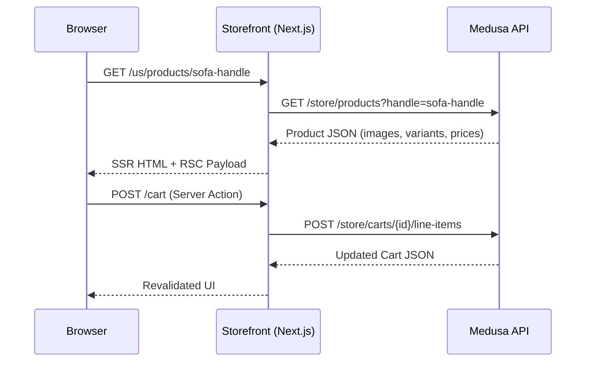

# WELL.md — 高端家居电商站点规划文档

> **品牌名**：WELL（自拟，替代 RH 商标）
> **定位**：基于 Medusa 2.x + Next.js 15 的高端家居电商前端，版式与交互语言对标 RH.com
> **版本**：v1.1（决策已确认）
> **日期**：2026-04-12
> **关联文档**：`RH-CLONE-ARCHITECTURE.md`（执行流程）· `CLAUDE.md`（编码规范）

---

## 1. 项目概览

### 1.1 目标

| 维度 | 目标 |
|------|------|
| **视觉语言** | 复刻 RH.com 的版式骨架、栅格系统、信息层级、留白哲学与动效节奏，形成"建筑感奢侈品电商"风格 |
| **功能完整度** | P0 页面（Home / PLP / PDP / Cart / Checkout / Header+Footer）端到端可用，数据走 Medusa 原生 API |
| **工程质量** | TypeScript 零报错、无 Hydration mismatch、全 token 化设计系统、响应式 375px–1920px+ |
| **交付物** | 可在 `localhost:8000` 独立运行的完整前端，搭配 `localhost:9000` Medusa 后端 |

### 1.2 非目标

- **不做**：后端业务逻辑开发（Medusa 2.x 默认能力已足够）
- **不做**：SEO 深度优化（meta/sitemap 等留后续迭代）
- **不做**：性能极致调优（Core Web Vitals 优化留 P2）
- **不做**：多语言/多货币（保留 Medusa 原生 i18n 框架，不扩展）
- **不做**：CMS 集成（内容暂用硬编码占位）

### 1.3 合规边界

| 禁止 | 允许 | 替代方案 |
|------|------|----------|
| RH 商标、Logo | 自拟品牌名 "WELL" | 纯文字 Logo（Cormorant Garamond 衬线体） |
| RH 产品图 | CC0 占位图 | Unsplash/Picsum（家居/建筑类） |
| RH 商品文案 | 自拟占位文案 | Lorem Ipsum 或自写短描述 |
| RH 字体文件（RHSans） | 免费替代 | Cormorant Garamond (serif) + Inter (sans-serif) |
| RH 品牌色精确值 | 近似中性色系 | `qw-*` token 体系（已定义，见 §4） |

---

## 2. 技术架构图

```mermaid
graph TB
    subgraph Client["Browser (用户端)"]
        UI["Next.js App<br/>React 19 + Tailwind CSS 3"]
    end

    subgraph Storefront["Storefront Server (:8000)"]
        direction TB
        AppRouter["Next.js 15 App Router<br/>(Server Components)"]
        RSC["React Server Components<br/>数据获取层"]
        ClientComp["Client Components<br/>交互/动画层"]
        StaticAssets["Static Assets<br/>/public"]

        AppRouter --> RSC
        AppRouter --> ClientComp
        AppRouter --> StaticAssets
    end

    subgraph Backend["Medusa Backend (:9000)"]
        direction TB
        MedusaAPI["Medusa 2.x REST API"]
        subgraph DataLayer["数据层"]
            Products["Products"]
            Collections["Collections"]
            Categories["Categories"]
            Cart["Cart / Orders"]
            Customers["Customers"]
            Regions["Regions"]
        end
        MedusaAPI --> DataLayer
    end

    subgraph DB["PostgreSQL"]
        PG["本地 PostgreSQL"]
    end

    subgraph External["外部服务"]
        Stripe["Stripe<br/>(支付)"]
        S3["S3 / MinIO<br/>(图片存储)"]
    end

    UI -->|HTTP/HTTPS| Storefront
    RSC -->|@medusajs/js-sdk<br/>Server Actions| MedusaAPI
    ClientComp -->|fetch / Server Actions| RSC
    MedusaAPI --> PG
    MedusaAPI --> Stripe
    MedusaAPI --> S3

    style Client fill:#f9f7f4,stroke:#1a1a1a,color:#1a1a1a
    style Storefront fill:#ffffff,stroke:#1a1a1a,color:#1a1a1a
    style Backend fill:#f5f5f0,stroke:#1a1a1a,color:#1a1a1a
    style DB fill:#e8e8e8,stroke:#1a1a1a,color:#1a1a1a
    style External fill:#faf9f6,stroke:#1a1a1a,color:#1a1a1a
```

### 2.1 数据流概览



---

## 3. 目录结构

```
rh-storefront/
├── WELL.md                          # 本文件 — 规划文档
├── RH-CLONE-ARCHITECTURE.md         # 执行流程文档
├── CLAUDE.md                        # 编码规范文档
├── package.json                     # 依赖管理 (yarn 4.x)
├── next.config.js                   # Next.js 配置（图片域名、构建选项）
├── tailwind.config.js               # Tailwind 扩展（qw-* tokens, screens, fonts）
├── tsconfig.json                    # TypeScript 配置（@modules/* @lib/* 别名）
├── postcss.config.js                # PostCSS（Tailwind 管道）
│
├── public/                          # 静态资源
│   ├── favicon.ico
│   └── images/                      # 占位图、品牌素材
│
└── src/
    ├── app/                         # Next.js 15 App Router 路由
    │   ├── layout.tsx               # 根布局（字体加载、全局 body 样式）
    │   ├── not-found.tsx            # 全局 404
    │   └── [countryCode]/           # 国际化路由前缀
    │       ├── (main)/              # 主内容路由组
    │       │   ├── layout.tsx       #   └ Nav + Footer 包裹
    │       │   ├── template.tsx     #   └ 页面过渡动画（Framer Motion）
    │       │   ├── page.tsx         #   └ 首页
    │       │   ├── store/           #   └ 全部商品 PLP
    │       │   ├── collections/     #   └ 集合页 PLP
    │       │   ├── categories/      #   └ 分类页 PLP
    │       │   ├── products/        #   └ PDP
    │       │   ├── cart/            #   └ 购物车
    │       │   ├── account/         #   └ 账户（@dashboard/@login 并行插槽）
    │       │   ├── about/           #   └ [P1] 品牌故事
    │       │   ├── design-services/ #   └ [P1] 设计服务
    │       │   └── order/           #   └ 订单详情/确认
    │       └── (checkout)/          # 结账路由组（独立极简布局）
    │           └── checkout/        #   └ 结账流程
    │
    ├── lib/                         # 工具层（不改动）
    │   ├── config.ts                #   └ 运行时配置
    │   ├── constants.tsx            #   └ 全局常量
    │   ├── context/                 #   └ React Context（Modal 等）
    │   ├── data/                    #   └ Medusa API 数据获取函数（Server Actions）
    │   │   ├── products.ts          #     - listProducts / retrieveProduct
    │   │   ├── collections.ts       #     - listCollections
    │   │   ├── categories.ts        #     - listCategories
    │   │   ├── cart.ts              #     - addToCart / updateLineItem / removeItem
    │   │   ├── customer.ts          #     - login / register / getCustomer
    │   │   ├── regions.ts           #     - listRegions
    │   │   ├── orders.ts            #     - listOrders / retrieveOrder
    │   │   ├── fulfillment.ts       #     - getShippingOptions
    │   │   ├── payment.ts           #     - initPaymentSession
    │   │   └── nav-data.ts          #     - 导航品类数据
    │   ├── hooks/                   #   └ 自定义 Hooks
    │   │   ├── use-in-view.tsx      #     - IntersectionObserver 封装
    │   │   └── use-toggle-state.tsx #     - 布尔状态切换
    │   └── util/                    #   └ 工具函数
    │       ├── get-product-price.ts #     - 价格提取
    │       ├── money.ts             #     - 货币格式化
    │       ├── image-blur.ts        #     - blur placeholder 数据
    │       └── ...
    │
    ├── modules/                     # 功能模块（UI 改造主战场）
    │   ├── layout/                  # 全局布局 ── 已重写
    │   │   ├── templates/nav/       #   └ 双层 Header（NavShell + CatalogRow + Search）
    │   │   ├── templates/footer/    #   └ 4列 Footer + 邮件订阅
    │   │   ├── components/cart-dropdown/    # 购物车抽屉
    │   │   ├── components/side-menu/       # 移动端侧边菜单
    │   │   └── components/cart-button/     # 购物车图标
    │   │
    │   ├── home/                    # 首页组件
    │   │   ├── hero/                #   └ 全屏深色 Hero（home-hero-stack.tsx）
    │   │   └── featured-products/   #   └ 精选商品网格 + ProductRail
    │   │
    │   ├── products/                # 商品展示
    │   │   ├── components/product-preview/  # PLP 商品卡片
    │   │   ├── components/thumbnail/        # 缩略图（aspect-[3/4]）
    │   │   ├── components/image-gallery/    # PDP 图片画廊
    │   │   ├── components/product-actions/  # 变体选择 + 加购
    │   │   ├── components/product-tabs/     # Radix Accordion 折叠面板
    │   │   ├── components/product-price/    # 价格显示
    │   │   ├── components/related-products/ # 相关推荐
    │   │   └── templates/                   # PDP 页面模板 + product-info
    │   │
    │   ├── store/                   # PLP 商品列表
    │   │   ├── templates/           #   └ 主模板 + paginated-products + product-reveal
    │   │   ├── pagination/          #   └ 分页控件
    │   │   ├── refinement-list/     #   └ 筛选面板 + 排序
    │   │   └── lib/plp-view-config.ts #  └ 网格视图配置
    │   │
    │   ├── cart/                    # 购物车
    │   ├── checkout/                # 结账
    │   ├── account/                 # 账户
    │   ├── order/                   # 订单
    │   ├── common/                  # 公共 UI 原语（Input / Modal / Radio / Link 等）
    │   ├── skeletons/               # 骨架屏
    │   └── shipping/                # 配送提示
    │
    ├── styles/
    │   └── globals.css              # Tailwind imports + @layer base/components/utilities
    │
    └── types/                       # TypeScript 类型定义
        ├── global.ts
        └── icon.ts
```

---

## 4. Design Tokens 规范

### 4.1 颜色系统

> **命名规则**：`qw-` 前缀（"WELL" 品牌缩写），按亮度从暗到亮排列。
> **已在 `tailwind.config.js` 中定义**，此处为语义说明。

| Token | Hex | 语义 | 命名理由 |
|-------|-----|------|----------|
| `qw-black` | `#000000` | 主 CTA 填充、标题文字、最高对比 | 纯黑 = 建筑感、权威 |
| `qw-charcoal` | `#1A1A1A` | body 默认文字色、正文 | 略柔于纯黑，长文阅读更舒适 |
| `qw-dark-grey` | `#333333` | 二级标题、次要文字 | 明确的层级递减 |
| `qw-medium-grey` | `#666666` | 三级文字、辅助说明、placeholder | 中灰 = "辅助信息" |
| `qw-grey` | `#999999` | 禁用态、弱图标 | 最低可读灰度 |
| `qw-light-grey` | `#CCCCCC` | 边框、分隔线 | 结构性线条，不抢视觉 |
| `qw-pale-grey` | `#E8E8E8` | 浅边框、细分隔、骨架屏 | 几乎消失的线条 |
| `qw-off-white` | `#F5F5F0` | 卡片/区块背景（暖灰调） | 暖白 ≠ 纯白，制造层次 |
| `qw-warm-white` | `#FAF9F6` | 页面次级背景 | 比 off-white 更轻的暖底 |
| `qw-white` | `#FFFFFF` | body 背景、表单底、反色文字 | 最高亮度基准 |
| `qw-gold` | `#B8860B` | 品牌金色（会员标识、微点缀） | 暗金 = 奢华但不浮夸 |
| `qw-error` | `#C41E3A` | 错误提示、促销价、库存警告 | 经典警示红，与中性灰阶高对比 |

**Tailwind config 形式**（已存在于 `tailwind.config.js`）：

```javascript
colors: {
  "qw-black":      "#000000",
  "qw-charcoal":   "#1A1A1A",
  "qw-dark-grey":  "#333333",
  "qw-medium-grey":"#666666",
  "qw-grey":       "#999999",
  "qw-light-grey": "#CCCCCC",
  "qw-pale-grey":  "#E8E8E8",
  "qw-off-white":  "#F5F5F0",
  "qw-warm-white": "#FAF9F6",
  "qw-white":      "#FFFFFF",
  "qw-gold":       "#B8860B",
  "qw-error":      "#C41E3A",
}
```

### 4.2 字体系统

| 角色 | 字体族 | Tailwind class | 字重 | 加载方式 | 命名理由 |
|------|--------|---------------|------|----------|----------|
| 品牌/标题 | Cormorant Garamond | `font-serif` | 300, 400 | `next/font/google` + CSS var `--font-serif` | 高对比衬线，近似 RH 的建筑优雅感 |
| 正文/UI | **Inter**（Variable Font） | `font-sans` | 100–900（可变） | **`next/font/local`** + CSS var `--font-sans`；字体文件存于 `src/fonts/` | x-height 高、小字号极清晰，跨平台一致，零 CDN 依赖 |

**字体文件位置**（已下载，来源：`@fontsource-variable/inter`）：
```
src/fonts/
├── Inter-Variable.woff2            # 拉丁子集，48KB
└── Inter-Variable-Latin-Ext.woff2  # 拉丁扩展子集，85KB
```

**`app/layout.tsx` 加载方式**（已配置）：
```typescript
const inter = localFont({
  src: [
    { path: "../fonts/Inter-Variable.woff2", style: "normal" },
    { path: "../fonts/Inter-Variable-Latin-Ext.woff2", style: "normal" },
  ],
  variable: "--font-sans",
  display: "swap",
  weight: "100 900",
})
```

**`tailwind.config.js` 字体栈**（已配置）：
```javascript
fontFamily: {
  sans: ["var(--font-sans)", "Inter", "Helvetica Neue", "Arial", "sans-serif"],
  serif: ["var(--font-serif)", "ui-serif", "Georgia", "serif"],
}
```

### 4.3 字号阶梯

| Token | 大小 | 行高 | Tailwind class | 用途 | 命名理由 |
|-------|------|------|---------------|------|----------|
| `micro` | 10px | 14px | `text-micro` | 眉标、标签、面包屑 | 最小可读字号 |
| `caption` | 12px | 16px | `text-caption` | 辅助说明、系列名 | 图片说明文字 |
| `body` | 14px | 20px | `text-body` | 正文 | 默认阅读字号 |
| `body-lg` | 16px | 24px | `text-body-lg` | 大正文、强调段落 | body 的放大版 |
| `card-title` | 20px | 28px | `text-card-title` | 卡片标题、导航 Logo | 中等标题 |
| `section-title` | 32px | 40px | `text-section-title` | 区块标题 | 页面内分区标题 |
| `hero` | 48px | 56px | `text-hero` | 首屏大标题 | 最大展示字号 |

### 4.4 间距系统

| 维度 | 规则 | Tailwind |
|------|------|----------|
| **基准单位** | 4px | `qw-1` = 0.25rem |
| **Token 范围** | 4px ~ 96px（24 级） | `qw-1` ~ `qw-24` |
| **Section 间距** | 桌面 80px / 移动端 48px | `py-20` / `py-12` |
| **内容容器** | max-width **2560px**（`max-w-body`），padding-x 24px | `.content-container` |
| **卡片间距** | 24px | `gap-6` |

### 4.5 圆角与阴影

| 属性 | 规则 | 命名理由 |
|------|------|----------|
| **圆角** | 全局 `rounded-none`（直角） | 建筑感 = 锐利边缘，无柔化 |
| **阴影** | 仅浮层（Menu/Modal/Drawer）用轻阴影 | 扁平设计，用边框/留白而非阴影分层 |

### 4.6 动效系统

| Token | 场景 | 属性 | 时长 | 缓动 | 命名理由 |
|-------|------|------|------|------|----------|
| `hover-btn` | 按钮 hover | opacity | 300ms | ease | 快速反馈，不拖沓 |
| `hover-img` | 图片 hover 缩放 | scale(1.03) | 800ms | cubic-bezier(0.25,0.1,0.25,1) | 缓慢放大 = 优雅 |
| `page-transition` | 路由切换 | opacity | 350ms | cubic-bezier(0.16,1,0.3,1) | 平滑过渡 |
| `card-reveal` | 商品卡入场 | opacity + translateY(28px) | 500ms | cubic-bezier(0.16,1,0.3,1) | 向上浮现 = 发现感 |
| `nav-hover` | 导航链接 hover | opacity + translateY(-2px) | 300ms | ease | 微上浮 = 精致 |
| `drawer-slide` | 侧边菜单/购物车抽屉 | translateX | 500ms | cubic-bezier(0.16,1,0.3,1) | 滑入 = 空间感 |
| `accordion` | 面板展开/收起 | height + opacity | 300ms | cubic-bezier(0.87,0,0.13,1) | 紧凑感 |

---

## 5. 组件清单（P0）

### 5.1 全局组件

| 组件名 | 路径 | Props | 状态 | RH 参考区块 | 当前进度 |
|--------|------|-------|------|-------------|----------|
| **NavShell** | `layout/templates/nav/nav-shell.tsx` | `children: ReactNode` | `tone: 'solid' \| 'overlay'`, `scrolled: boolean` | 顶部导航栏（固定/透明双态） | ✅ 已重写 |
| **Nav** | `layout/templates/nav/index.tsx` | 无（async Server Component） | — | 导航主容器 | ✅ 已重写 |
| **NavCatalogRow** | `layout/templates/nav/nav-catalog-row.tsx` | 无 | — | 第二层品类导航条 | ✅ 已重写 |
| **MegaMenu** | `layout/components/mega-menu/index.tsx`（新建） | `category: NavCategory` | `activeCategory: string \| null` | 品类 hover 展开的二级面板（品类树 + 编辑图） | 🔲 **P0 待开发** |
| **NavSearchInline** | `layout/templates/nav/nav-search-inline.tsx` | 无 | `isOpen: boolean` | 搜索图标/内联搜索 | ✅ 已重写 |
| **NavRegionSwitcher** | `layout/templates/nav/nav-region-switcher.tsx` | `regions, locales, currentLocale` | `isOpen: boolean` | 地区/语言切换 | ✅ 已重写 |
| **SideMenu** | `layout/components/side-menu/index.tsx` | `regions, locales, currentLocale, topLevelCategories, iconClassName` | `isOpen: boolean` | 移动端汉堡菜单 | ✅ 已重写 |
| **CartDropdown** | `layout/components/cart-dropdown/index.tsx` | `cart: StoreCart` | `isOpen: boolean`, `autoShow: boolean` | 购物车抽屉（右侧滑入） | ✅ 已重写 |
| **Footer** | `layout/templates/footer/index.tsx` | 无 | — | 4 列 Footer + 订阅 | ✅ 已重写 |

### 5.2 首页组件

| 组件名 | 路径 | Props | 状态 | RH 参考区块 | 当前进度 |
|--------|------|-------|------|-------------|----------|
| **HomeHeroStack** | `home/hero/home-hero-stack.tsx` | 无 | 入场动画 | 全屏深色 Hero + 品牌标题 + CTA | ✅ 已实现 |
| **FeaturedProducts** | `home/featured-products/index.tsx` | `collections, region` | — | 精选商品网格 | ⚠️ 需验证样式 |
| **ProductRail** | `home/featured-products/product-rail/index.tsx` | `collection, region` | — | 商品横向滑轨 | ⚠️ 需验证样式 |

### 5.3 PLP 组件

| 组件名 | 路径 | Props | 状态 | RH 参考区块 | 当前进度 |
|--------|------|-------|------|-------------|----------|
| **ProductPreview** | `products/components/product-preview/index.tsx` | `product, isFeatured, region` | — | 商品卡片（图 + 系列名 + 名称 + 价格） | ⚠️ 基本完成，需微调 |
| **Thumbnail** | `products/components/thumbnail/index.tsx` | `thumbnail, images, size, isFeatured, className` | — | 图片容器（3:4 比例 + hover 缩放） | ✅ 已修正为 aspect-[3/4] |
| **PreviewPrice** | `products/components/product-preview/price.tsx` | `price` | — | 卡片价格显示 | ✅ |
| **PaginatedProducts** | `store/templates/paginated-products.tsx` | `products, page, totalPages, viewConfig` | 分页/视图切换 | 商品网格 + 分页 | ⚠️ 需按可配置列数更新 |
| **PLPViewConfig** | `store/lib/plp-view-config.ts` | — | — | 网格列数配置：`{mobileColumns: 1\|2, desktopColumns: 1\|2\|3, default: 3}` | ⚠️ 需扩展配置结构 |
| **ProductReveal** | `store/templates/product-reveal.tsx` | `children` | IntersectionObserver 触发 | 卡片入场动画 | ✅ 已实现 |
| **RefinementList** | `store/refinement-list/index.tsx` | `refinementList, setRefinementList` | — | 筛选面板 | ⚠️ 需验证样式 |
| **SortProducts** | `store/refinement-list/sort-products/index.tsx` | `sortBy, setQueryParams` | — | 排序下拉 | ⚠️ 需验证样式 |
| **Pagination** | `store/pagination/index.tsx` | `page, totalPages` | — | 页码控件 | ⚠️ 需验证样式 |

### 5.4 PDP 组件

| 组件名 | 路径 | Props | 状态 | RH 参考区块 | 当前进度 |
|--------|------|-------|------|-------------|----------|
| **ImageGallery** | `products/components/image-gallery/index.tsx` | `images: StoreProductImage[]` | `selectedIndex`, lightbox | 左缩略图 + 右主图 | ✅ 已重写 |
| **ProductInfo** | `products/templates/product-info/index.tsx` | `product, region` | — | 面包屑 + 标题 + 价格 + 描述 | ✅ 已对齐 |
| **ProductPriceRow** | `products/templates/product-info/product-price-row.tsx` | `product, variant` | — | 价格行（含促销色） | ✅ 已对齐 |
| **ProductActions** | `products/components/product-actions/index.tsx` | `product, region, disabled` | `variant, quantity, isAdding` | 变体选择 + 加购按钮 | ✅ 已重写 |
| **OptionSelect** | `products/components/product-actions/option-select.tsx` | `option, current, updateOption` | — | 变体按钮组 | ✅ 已对齐 |
| **MobileActions** | `products/components/product-actions/mobile-actions.tsx` | `product, region` | `isOpen` | 移动端底部操作栏 | ❌ 需修正残留样式 |
| **ProductTabs** | `products/components/product-tabs/index.tsx` | `product` | — | Radix Accordion 折叠面板 | ✅ 已对齐 |
| **Accordion** | `products/components/product-tabs/accordion.tsx` | `title, children, defaultOpen` | open/closed | +/- 图标折叠面板 | ✅ 已对齐 |
| **RelatedProducts** | `products/components/related-products/index.tsx` | `product, countryCode` | — | 底部推荐商品 | ⚠️ 需验证样式 |

### 5.5 Cart / Checkout 组件

| 组件名 | 路径 | Props | 状态 | RH 参考区块 | 当前进度 |
|--------|------|-------|------|-------------|----------|
| **CartTemplate** | `cart/templates/index.tsx` | `cart, customer` | — | 购物车主模板 | ⚠️ 需重写样式 |
| **CartItem** | `cart/components/item/index.tsx` | `item, currencyCode` | quantity 更新中 | 购物车商品行 | ⚠️ 需重写样式 |
| **CartSummary** | `cart/templates/summary.tsx` | `cart` | — | 订单摘要 | ⚠️ 需重写样式 |
| **CheckoutForm** | `checkout/templates/checkout-form/index.tsx` | 无 | 步骤状态 | 结账表单主容器 | ⚠️ 需重写样式 |
| **CheckoutSummary** | `checkout/templates/checkout-summary/index.tsx` | 无 | — | 结账侧边摘要 | ⚠️ 需重写样式 |

### 5.6 骨架屏组件

| 组件名 | 路径 | 当前进度 |
|--------|------|----------|
| **SkeletonProductPreview** | `skeletons/components/skeleton-product-preview/index.tsx` | ✅ 已修正为 aspect-[3/4] |
| **SkeletonProductGrid** | `skeletons/templates/skeleton-product-grid/index.tsx` | ⚠️ 需对齐列数 |
| 其他骨架屏 | `skeletons/components/*` | ⚠️ 需统一 qw-pale-grey |

---

## 6. 页面蓝图（P0）

### 6.1 首页 (Home)

**路由**：`/[countryCode]/(main)/page.tsx`

```
┌─────────────────────────────────────────────────────┐
│                    [NAV OVERLAY]                     │  ← 透明导航，白色文字
│  ☰  🔍        W E L L        🌐  👤  🛒           │
│─────────────────────────────────────────────────────│
│                                                     │
│                                                     │
│              EXPLORE THE COLLECTION                  │  ← Hero: 全屏深色背景
│         Discover timeless design for modern living    │     font-serif uppercase
│                   [ SHOP NOW ]                       │     CTA: qw-btn-secondary (白描边)
│                                                     │
│                                                     │
├─────────────────────────────────────────────────────┤
│                                                     │
│  ┌──────────┐  ┌──────────┐  ┌──────────┐          │  ← 品类网格: 3列 (桌面)
│  │          │  │          │  │          │          │     深色图片 + 白色品类名
│  │  LIVING  │  │  DINING  │  │ BEDROOM  │          │     hover: scale(1.03)
│  └──────────┘  └──────────┘  └──────────┘          │
│                                                     │
├─────────────────────────────────────────────────────┤
│                                                     │
│            FEATURED COLLECTION NAME                  │  ← 精选商品区
│                                                     │     section-title, serif, uppercase
│  ┌────┐  ┌────┐  ┌────┐  ┌────┐                    │
│  │3:4 │  │3:4 │  │3:4 │  │3:4 │                    │  ← ProductPreview 卡片
│  │img │  │img │  │img │  │img │                    │     3:4 比例
│  │    │  │    │  │    │  │    │                    │
│  ├────┤  ├────┤  ├────┤  ├────┤                    │
│  │name│  │name│  │name│  │name│                    │
│  │$   │  │$   │  │$   │  │$   │                    │
│  └────┘  └────┘  └────┘  └────┘                    │
│                                                     │
├─────────────────────────────────────────────────────┤
│              [FOOTER 4 COLUMNS]                      │
└─────────────────────────────────────────────────────┘
```

**数据来源**：
- Hero：硬编码
- 品类网格：**硬编码**（在 `home/category-grid/category-data.ts` 中维护，含品类名、链接、占位图 URL）
- 精选商品：`GET /store/products?collection_id[]={id}&limit=4`（按集合拉取）

---

### 6.2 PLP — 商品列表页

**路由**：`/[countryCode]/(main)/store|collections/[handle]|categories/[...category]`

```
┌─────────────────────────────────────────────────────┐
│                    [NAV SOLID]                        │
├─────────────────────────────────────────────────────┤
│                                                     │
│              COLLECTION / CATEGORY NAME              │  ← section-title, serif, uppercase
│                                                     │
│  [Filter ▾]    [Sort ▾]           Showing 1-12 of 48│  ← 筛选 + 排序 + 计数
│                                                     │
│  ┌────┐  ┌────┐  ┌────┐                             │  ← 默认 3 列（可配置：1+3 / 2+3 / 3）
│  │3:4 │  │3:4 │  │3:4 │  │3:4 │                    │
│  │    │  │    │  │    │  │    │                    │
│  ├────┤  ├────┤  ├────┤  ├────┤                    │
│  │ser.│  │ser.│  │ser.│  │ser.│                    │  ← 系列名 caption uppercase
│  │name│  │name│  │name│  │name│                    │  ← 商品名 caption
│  │$   │  │$   │  │$   │  │$   │                    │  ← 价格
│  └────┘  └────┘  └────┘  └────┘                    │
│                                                     │
│  ┌────┐  ┌────┐  ┌────┐  ┌────┐                    │
│  │    │  │    │  │    │  │    │                    │
│  │ ...│  │ ...│  │ ...│  │ ...│                    │
│  └────┘  └────┘  └────┘  └────┘                    │
│                                                     │
│            [ 1 ] [ 2 ] [ 3 ] [ → ]                  │  ← 分页
│                                                     │
├─────────────────────────────────────────────────────┤
│              [FOOTER]                                │
└─────────────────────────────────────────────────────┘
```

**列数配置规则**（通过 `plp-view-config.ts` 按 collection/category handle 配置）：

| 模式 | 移动端 | 桌面端 | 适用场景 |
|------|--------|--------|----------|
| `1+3`（默认） | 1 列 | 3 列 | 大件家具（沙发、床） |
| `2+3` | 2 列 | 3 列 | 中小件（灯具、配饰） |
| `3` | 3 列 | 3 列 | （预留，暂不使用） |

未配置的 collection 默认使用 `2+3`（移动端 2 列，桌面 3 列）。

**移动端**：筛选面板改为底部抽屉。

**数据来源**：
- 商品列表：`GET /store/products?collection_id[]={id}&limit=12&offset={page*12}`
- 集合信息：`GET /store/collections/{handle}`
- 分类信息：`GET /store/product-categories?handle={handle}`
- 排序：`order` 参数（`created_at`, `price`, `title`）

---

### 6.3 PDP — 商品详情页

**路由**：`/[countryCode]/(main)/products/[handle]`

```
┌─────────────────────────────────────────────────────┐
│                    [NAV SOLID]                        │
├────────────────────────┬────────────────────────────┤
│                        │                            │
│  ┌──┐  ┌────────────┐  │  Living / Sofas            │  ← 面包屑 caption uppercase
│  │  │  │            │  │                            │
│  │th│  │   MAIN     │  │  PRODUCT TITLE              │  ← clamp(22px,2.6vw,28px) sans light
│  │um│  │   IMAGE    │  │                            │
│  │bn│  │            │  │  Starting at $2,495         │  ← 13px, tracking-[0.165px]
│  │  │  │            │  │                            │
│  │  │  │            │  │  Short description text...  │  ← 13px, leading-[1.66rem]
│  │  │  │            │  │                            │
│  ├──┤  └────────────┘  │  Size Options               │
│  │  │                  │  ┌──┐ ┌──┐ ┌──┐ ┌──┐       │  ← 变体按钮组
│  │  │                  │  │6'│ │7'│ │8'│ │9'│       │
│  └──┘                  │  └──┘ └──┘ └──┘ └──┘       │
│                        │                            │
│                        │  Fabric Options             │
│                        │  ┌────┐ ┌────┐ ┌────┐      │
│                        │  │Linen│ │Velv│ │Perf│      │
│                        │  └────┘ └────┘ └────┘      │
│                        │                            │
│                        │  ┌──────────────────────┐  │
│                        │  │   ADD TO CART         │  │  ← qw-btn-primary w-full
│                        │  └──────────────────────┘  │
│                        │                            │
│                        │  ─── DIMENSIONS ──────(+)  │  ← Accordion
│                        │  ─── DETAILS ─────────(+)  │
│                        │  ─── SHIPPING ────────(+)  │
│                        │  ─── CARE ────────────(+)  │
│                        │                            │
├────────────────────────┴────────────────────────────┤
│                                                     │
│              YOU MAY ALSO LIKE                        │  ← 相关推荐
│  ┌────┐  ┌────┐  ┌────┐  ┌────┐                    │
│  │    │  │    │  │    │  │    │                    │
│  └────┘  └────┘  └────┘  └────┘                    │
│                                                     │
├─────────────────────────────────────────────────────┤
│              [FOOTER]                                │
└─────────────────────────────────────────────────────┘
```

**移动端**：图片堆叠在上 → 信息区全宽在下，底部固定操作栏。

**数据来源**：
- 商品详情：`GET /store/products/{id}?fields=*variants.calculated_price`
- 变体价格：实时随 `variant_id` 切换
- 相关商品：`GET /store/products?collection_id[]={same_collection}&limit=4`

---

### 6.4 Cart — 购物车页

**路由**：`/[countryCode]/(main)/cart`

```
┌─────────────────────────────────────────────────────┐
│                    [NAV SOLID]                        │
├─────────────────────────────────────────────────────┤
│                                                     │
│                    SHOPPING CART                      │  ← section-title serif uppercase
│                                                     │
│  ┌──────────────────────────┬──────────────────┐    │
│  │                          │                  │    │
│  │  ┌───┐                   │  ORDER SUMMARY   │    │
│  │  │img│  Product Title    │                  │    │
│  │  │   │  Option: Value    │  Subtotal  $XXX  │    │
│  │  │   │  Qty: [-] 1 [+]  │  Shipping  FREE  │    │
│  │  │   │  $X,XXX   [×]    │  Tax       $XX   │    │
│  │  └───┘                   │  ────────────    │    │
│  │                          │  Total    $X,XXX │    │
│  │  ┌───┐                   │                  │    │
│  │  │img│  Product Title    │  ┌────────────┐  │    │
│  │  │   │  ...              │  │  CHECKOUT  │  │    │
│  │  └───┘                   │  └────────────┘  │    │
│  │                          │                  │    │
│  └──────────────────────────┴──────────────────┘    │
│                                                     │
├─────────────────────────────────────────────────────┤
│              [FOOTER]                                │
└─────────────────────────────────────────────────────┘
```

**移动端**：商品列表在上，摘要在下。

**数据来源**：
- 购物车：`GET /store/carts/{id}` (通过 cookie `_medusa_cart_id`)
- 更新数量：`POST /store/carts/{id}/line-items/{item_id}` (Server Action)
- 删除：`DELETE /store/carts/{id}/line-items/{item_id}` (Server Action)

---

### 6.5 Checkout — 结账页

**路由**：`/[countryCode]/(checkout)/checkout`

```
┌─────────────────────────────────────────────────────┐
│  ← Back to cart          W E L L                     │  ← 极简 Header
├─────────────────────────────────────────────────────┤
│                                                     │
│  ┌───────────────────────┬─────────────────────┐    │
│  │                       │                     │    │
│  │  SHIPPING ADDRESS     │  ORDER SUMMARY      │    │
│  │  ┌─────────────────┐  │                     │    │
│  │  │ First Name      │  │  ┌───┐ Product  $XX │    │
│  │  └─────────────────┘  │  │   │              │    │
│  │  ┌─────────────────┐  │  └───┘              │    │
│  │  │ Last Name       │  │                     │    │
│  │  └─────────────────┘  │  Subtotal    $XXX   │    │
│  │  ┌─────────────────┐  │  Shipping    FREE   │    │
│  │  │ Address         │  │  Tax         $XX    │    │
│  │  └─────────────────┘  │  ──────────────     │    │
│  │  ...                  │  Total      $X,XXX  │    │
│  │                       │                     │    │
│  │  SHIPPING METHOD      │                     │    │
│  │  ○ Standard (Free)    │                     │    │
│  │  ○ Express ($XX)      │                     │    │
│  │                       │                     │    │
│  │  PAYMENT              │                     │    │
│  │  [Stripe Elements]    │                     │    │
│  │                       │                     │    │
│  │  ┌─────────────────┐  │                     │    │
│  │  │   PLACE ORDER   │  │                     │    │
│  │  └─────────────────┘  │                     │    │
│  │                       │                     │    │
│  └───────────────────────┴─────────────────────┘    │
│                                                     │
└─────────────────────────────────────────────────────┘
```

**数据来源**：
- 地址：`POST /store/carts/{id}` (更新 shipping/billing address)
- 配送方式：`GET /store/shipping-options?cart_id={id}`
- 支付：`POST /store/carts/{id}/payment-sessions` → Stripe
- 下单：`POST /store/carts/{id}/complete`

---

## 7. Medusa 数据模型映射

### 7.1 核心实体映射

| Medusa 实体 | 前端展示 | API Endpoint | 说明 |
|-------------|----------|-------------|------|
| `Product` | PLP 卡片 / PDP 全信息 | `GET /store/products` | 含 variants, images, options, collection |
| `ProductVariant` | PDP 变体选择器、价格切换 | 嵌套在 Product 内 | `calculated_price` 需传 `region_id` |
| `ProductCollection` | PLP 集合页标题、首页精选区 | `GET /store/collections` | 对应"系列名"（如 Cloud Sofa） |
| `ProductCategory` | 导航品类、PLP 分类页 | `GET /store/product-categories` | 支持多级层级（parent_category_id） |
| `Region` | 地区/货币切换、价格显示 | `GET /store/regions` | 决定 currency_code、tax 规则 |
| `Cart` | 购物车页、购物车抽屉 | `GET/POST /store/carts/{id}` | `_medusa_cart_id` cookie 关联 |
| `LineItem` | 购物车商品行 | 嵌套在 Cart 内 | 含 quantity、unit_price、variant 信息 |
| `Order` | 订单确认、账户订单列表 | `GET /store/orders` | 含 items、fulfillments、payment |
| `Customer` | 登录/注册、账户管理 | `GET/POST /store/customers` | auth token 机制 |
| `ShippingOption` | 结账配送方式选择 | `GET /store/shipping-options` | 按 region 筛选 |
| `PaymentSession` | 结账支付（Stripe） | `POST /store/carts/{id}/payment-sessions` | provider_id = "stripe" |

### 7.2 数据流向图

```
Medusa Product
├── title          → PLP: 商品名 / PDP: H1 标题
├── handle         → URL: /products/{handle}
├── thumbnail      → PLP: ProductPreview 主图
├── images[]       → PDP: ImageGallery 全部图片
├── description    → PDP: 商品描述段落
├── collection     → PLP: 系列名（眉标） / 首页: 精选区标题
├── categories[]   → 导航: 品类树 / PLP: 分类页
├── options[]      → PDP: OptionSelect 变体选择器
│   └── values[]   →       每个选项的可选值
├── variants[]     → PDP: 价格切换、库存判断
│   ├── calculated_price → PDP: 当前价格
│   ├── original_price   → PDP: 原价（划线价）
│   └── inventory_quantity → PDP: 库存提示
└── tags[]         → PLP: 备选系列名来源
```

---

## 8. 执行计划

### Phase 0：Design Tokens 验证与补齐

| 项 | 内容 |
|-----|------|
| **输入** | `tailwind.config.js`、`globals.css`、`app/layout.tsx` |
| **任务** | 1. 审计现有 token 完整性（对照 §4 检查遗漏）<br/>2. ✅ **已确认**：`content-container` max-width = **2560px**（`max-w-body`），保持现状<br/>3. ✅ **已完成**：Inter Variable Font 本地存储于 `src/fonts/`，`next/font/local` 配置完成<br/>4. 确认 Cormorant Garamond 300/400 正确加载<br/>5. 统一 `globals.css` 中残留的非 token 值 |
| **产物** | 更新后的 `tailwind.config.js` + `globals.css` + `app/layout.tsx` |
| **验收** | ✅ `npx tsc --noEmit` 零报错<br/>✅ 所有 `qw-*` token 在 class 中可用<br/>✅ `font-sans`（Inter）和 `font-serif`（Cormorant Garamond）均可正确渲染<br/>✅ `.content-container` max-width = 2560px<br/>✅ 字体文件从 `src/fonts/` 本地加载，无外部 CDN 依赖 |
| **Token 消耗** | ~5K |

### Phase 1：全局布局壳（Header + Footer + 过渡动画）

| 项 | 内容 |
|-----|------|
| **输入** | Phase 0 产物 + `layout/templates/nav/` + `layout/templates/footer/` |
| **任务** | 1. 验证双层 Header 在所有断点表现（已重写，重点检查 overlay/solid 切换）<br/>2. **🔲 新增 MegaMenu**：`NavCatalogRow` 品类链接 hover 时展开二级面板，含品类树 + 编辑图，新建 `layout/components/mega-menu/index.tsx`<br/>3. 验证 Footer 4 列 → 移动端折叠<br/>4. 验证购物车抽屉滑入动画<br/>5. 验证移动端侧边菜单<br/>6. 确认 `template.tsx` 页面过渡动画 |
| **产物** | 全站导航和页脚在所有视口正确渲染；MegaMenu 可用 |
| **验收** | ✅ 桌面：双层导航可见，品类链接 hover 展开 MegaMenu<br/>✅ MegaMenu：全宽展开，展示二级品类链接 + 至少 1 张编辑图<br/>✅ MegaMenu 展开/收起动画（translateY + opacity，300ms）<br/>✅ 375px：汉堡菜单 → 侧边菜单从左滑入（移动端不显示 MegaMenu）<br/>✅ 购物车抽屉从右滑入，120ms 延迟关闭<br/>✅ Footer 桌面 4 列，移动端手风琴折叠<br/>✅ 页面切换有 opacity 过渡 |
| **Token 消耗** | ~8K |

### Phase 2：首页

| 项 | 内容 |
|-----|------|
| **输入** | Phase 1 产物 + `home/` 组件 + Medusa collections/products 数据 |
| **任务** | 1. 完善 Hero 区（全屏深色 + 入场动画）<br/>2. 新增/完善品类网格（3列桌面，2列平板，1列移动）<br/>3. 精选商品网格（从 Medusa 拉取 collection 数据）<br/>4. 首页 `page.tsx` 串联所有区块 |
| **产物** | 首页完整可浏览 |
| **验收** | ✅ Hero 全屏，文字居中，CTA 可点击<br/>✅ 品类网格 hover 有 scale(1.03) 动效<br/>✅ 精选商品从 Medusa API 获取真实数据<br/>✅ 所有图片有 blur placeholder<br/>✅ 375px 下无横向溢出 |
| **Token 消耗** | ~15K |

### Phase 3：PLP 商品列表页

| 项 | 内容 |
|-----|------|
| **输入** | Phase 2 产物 + `store/` + `products/components/product-preview/` |
| **任务** | 1. ProductPreview 卡片对标 RH（3:4 图 + 系列名 + 名称 + 价格）<br/>2. **扩展 `plp-view-config.ts`**：支持 `1+3` / `2+3` 两种列数模式，默认 `2+3`（移动 2 列、桌面 3 列）<br/>3. **更新 `paginated-products.tsx`**：根据 viewConfig 动态切换 Tailwind 网格 class<br/>4. ProductReveal 入场动画<br/>5. 筛选/排序面板样式对齐<br/>6. 分页控件样式 |
| **产物** | `/store`、`/collections/[handle]`、`/categories/[...category]` 完整可浏览 |
| **验收** | ✅ 商品卡片图片 3:4 比例，hover 缩放 800ms<br/>✅ 卡片入场动画（opacity + translateY）<br/>✅ 移动端 2 列，桌面 3~4 列<br/>✅ 分页跳转正常<br/>✅ 筛选/排序功能可用 |
| **Token 消耗** | ~12K |

### Phase 4：PDP 商品详情页

| 项 | 内容 |
|-----|------|
| **输入** | Phase 3 产物 + `products/` 全部组件 |
| **任务** | 1. 验证 ImageGallery 桌面/移动端布局<br/>2. 修正 MobileActions 残留 Medusa 原生样式（§5 中标 ❌ 的项）<br/>3. 验证变体选择 → 价格联动<br/>4. 验证加购流程（→ 购物车抽屉弹出）<br/>5. 验证折叠面板（+/- 图标 + 300ms 动画）<br/>6. 相关推荐区样式 |
| **产物** | `/products/[handle]` 完整可用，加购流程打通 |
| **验收** | ✅ 桌面：左缩略图 + 右主图<br/>✅ 移动端：顶部大图 + 底部横滚缩略图<br/>✅ 变体切换后价格实时更新<br/>✅ 加购后购物车抽屉从右弹出<br/>✅ 折叠面板有 +/- 形变动画<br/>✅ 移动端底部操作栏样式正确（无 Medusa 原生残留） |
| **Token 消耗** | ~15K |

### Phase 5：Cart + Checkout

| 项 | 内容 |
|-----|------|
| **输入** | Phase 4 产物 + `cart/` + `checkout/` |
| **任务** | 1. 购物车页样式重写（左右分栏 → 移动端堆叠）<br/>2. 结账页样式重写（Input 底部单线、无圆角）<br/>3. 结账 Header 极简化（← 返回 + Logo）<br/>4. 验证完整购物流程：加购 → 购物车 → 结账 → 下单 |
| **产物** | `/cart` + `/checkout` 完整可用 |
| **验收** | ✅ 购物车：增删改数量正常<br/>✅ 购物车：桌面左右分栏，移动端上下堆叠<br/>✅ 结账：地址 → 配送 → 支付 → 下单完整可走<br/>✅ 结账表单 Input 底部单线无圆角<br/>✅ 下单后跳转订单确认页 |
| **Token 消耗** | ~20K |

---

## 9. 验收标准（DoD）

### 9.1 全局验收（适用于所有页面）

- [ ] `npx tsc --noEmit` 零 TypeScript 报错
- [ ] 浏览器控制台无 Hydration mismatch 警告
- [ ] 375px 视口下无横向滚动条
- [ ] 所有 `<Image>` 有 `alt` 属性
- [ ] 无非 token 色值（无 `bg-white`、无裸 hex）
- [ ] 无禁止样式（无 `shadow-*`、无 `rounded-md+`、无 `bg-gradient-*`）
- [ ] 字体正确加载（衬线标题 + 无衬线正文）
- [ ] 无蓝色链接，所有链接 `text-inherit`

### 9.2 首页验收

- [ ] Hero 全屏深色，文字居中，入场动画流畅（opacity + translateY）
- [ ] 品类网格桌面 3 列 → 平板 2 列 → 移动 1 列
- [ ] 品类卡片 hover 有 scale(1.03) 缩放
- [ ] 精选商品区显示 Medusa 真实数据
- [ ] 所有图片 blur placeholder 正常
- [ ] 导航 overlay 模式在 Hero 上方透明显示

### 9.3 PLP 验收

- [ ] 商品卡片图片 `aspect-[3/4]`，`overflow-hidden`
- [ ] hover 时图片 scale(1.03)，800ms 过渡
- [ ] 系列名显示（`collection.title` 或 `tags[0].value`）
- [ ] 卡片入场动画（IntersectionObserver 触发 opacity + translateY(28px)）
- [ ] 列数可配置：`1+3` 模式（移动 1 列、桌面 3 列）或 `2+3` 模式（移动 2 列、桌面 3 列）
- [ ] 未配置的 collection 默认 `2+3`
- [ ] 分页可用且样式对齐
- [ ] 筛选/排序面板可用
- [ ] 空状态有合理提示

### 9.4 PDP 验收

- [ ] 桌面左缩略图列 + 右主图（50/50 分栏）
- [ ] 移动端顶部大图 + 底部横滚缩略图
- [ ] 标题 `font-sans font-light uppercase`（非 serif）
- [ ] 价格行 13px，`tracking-[0.165px]`
- [ ] 变体选择器：`rounded-none`，选中态 `border-qw-black`
- [ ] 加购按钮：`bg-qw-black text-qw-white rounded-none w-full`
- [ ] 折叠面板 +/- 图标，300ms 展开动画
- [ ] 加购后购物车抽屉自动弹出
- [ ] 相关推荐区显示 4 个商品
- [ ] 移动端底部操作栏无 Medusa 原生样式残留

### 9.5 Cart 验收

- [ ] 桌面：左侧商品列表 + 右侧订单摘要
- [ ] 移动端：上下堆叠
- [ ] 数量增减正常，价格实时更新
- [ ] 删除商品正常
- [ ] "去结账" 按钮可跳转
- [ ] 空购物车有合理提示

### 9.6 Checkout 验收

- [ ] 极简 Header（← 返回购物车 + WELL Logo）
- [ ] 地址表单 Input 底部单线、无圆角
- [ ] 配送方式可选
- [ ] Stripe 支付组件正常加载
- [ ] "下单" 按钮可用
- [ ] 下单成功后跳转订单确认页

---

## 10. 风险与回滚

| 风险 | 影响 | 概率 | 应对 | 回滚 |
|------|------|------|------|------|
| **Medusa 后端未启动** | 全站数据空白 | 中 | 启动前检查 `localhost:9000/health` + 确保 Region/Sales Channel 已创建 | — |
| **字体 FOIT（Flash of Invisible Text）** | 首屏无文字闪烁 | 低 | `next/font` 的 `display: "swap"` 已配置 | 回退系统字体栈 |
| **图片域名未配置** | `<Image>` 组件报错 | 中 | `next.config.js` 的 `images.remotePatterns` 需覆盖所有图片域名 | 使用 `` 临时替代 |
| **Tailwind class 冲突（Medusa UI preset）** | 样式覆盖不生效 | 中 | `qw-*` 前缀隔离 + `!important` 作为最后手段 | 改用原生 `<button>` 替代 `<Button>` |
| **Hydration mismatch** | 控制台警告、布局闪烁 | 中 | Server/Client 分界严格遵循 §7.2；避免 `Date.now()` 等不稳定值 | `suppressHydrationWarning` 治标 |
| **移动端横向溢出** | 出现横向滚动条 | 高 | `html { overflow-x: clip }` 全局兜底 + 每个容器 `max-w-full` | 逐容器排查 `width > 100vw` |
| **Stripe 支付集成** | 结账流程中断 | 中 | 保留 Medusa 原生 Stripe wrapper，仅改外层样式 | 使用测试支付 provider |
| ~~**content-container max-width 不一致**~~ | ~~`CLAUDE.md` 记 1440px，实际 2560px~~ | ✅ **已解决** | 确认使用 **2560px**（`max-w-body`），CLAUDE.md §1.4 待同步 | — |
| ~~**PLP 列数决策**~~ | ~~RH 在不同品类用不同列数~~ | ✅ **已解决** | 采用可配置方案：`1+3` / `2+3`，默认 `2+3`，通过 `plp-view-config.ts` 管理 | — |
| **`!important` 滥用** | 样式维护困难 | 中 | 优先用原生元素 + `qw-btn-*` class；`!important` 仅用于覆盖 Medusa UI | 记录所有 `!important` 使用点，逐步迁移 |

---

## 附录 A：决策记录（已全部确认）

> 所有问题已于 2026-04-12 确认，下表为最终决策记录。

| # | 问题 | ✅ 决策 | 影响 |
|---|------|---------|------|
| 1 | `content-container` max-width | **2560px**（保持 `max-w-body` 现状） | §4.4 / §8 Phase 0 / CLAUDE.md §1.4 需同步 |
| 2 | PLP 网格列数 | **可配置**：`1+3`（移动 1 列 + 桌面 3 列）/ `2+3`（移动 2 列 + 桌面 3 列），默认 `2+3` | `plp-view-config.ts` 扩展 + `paginated-products.tsx` 动态 class |
| 3 | sans-serif 字体 | **Inter Variable Font，本地存储**（`src/fonts/`，`next/font/local`） | `app/layout.tsx` + `tailwind.config.js` 已更新 |
| 4 | 首页品类网格数据来源 | **硬编码**（`home/category-grid/category-data.ts`） | 无需 Medusa categories API，内容由前端维护 |
| 5 | Mega Menu 优先级 | **P0**（Phase 1 开发） | 新增 `layout/components/mega-menu/index.tsx` |

---

*文档版本 1.1 | 基于 Medusa Storefront 2.x + Next.js 15 | 品牌名 WELL | 所有决策已于 2026-04-12 确认*
