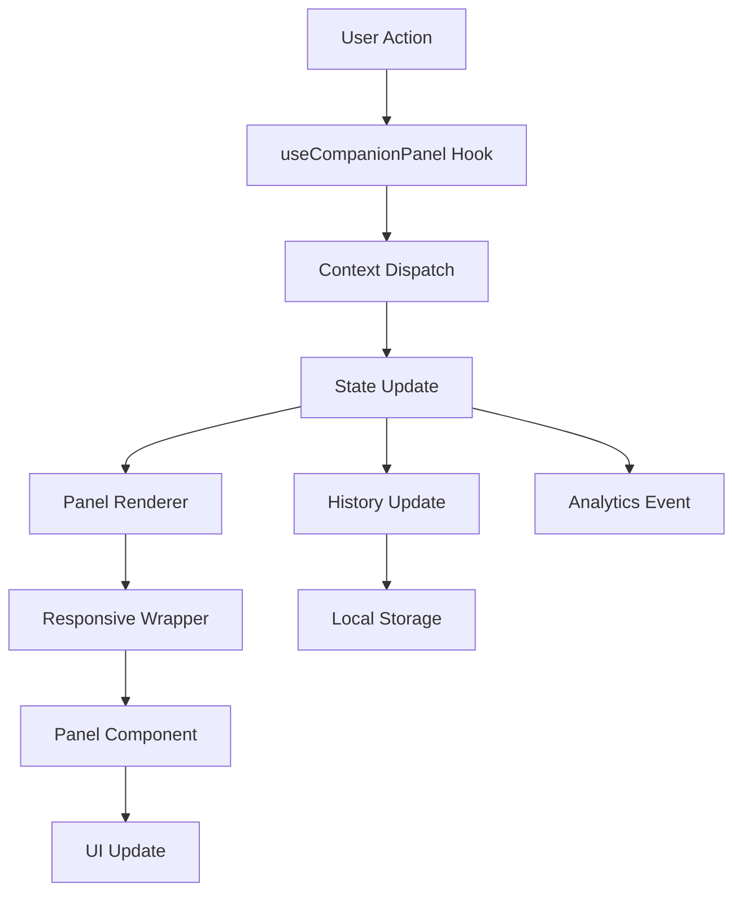

# 🏗️ System Architecture

## Core Components

The Companion Panel System is built around several key components that work together to provide a seamless user experience:

### 1. Context Provider (`CompanionPanelProvider`)

The central state management system that coordinates all panel interactions:

```typescript
interface CompanionPanelState {
  isOpen: boolean
  currentPanel: PanelType | null
  panelData: Record<string, any>
  history: PanelHistoryItem[]
  config: CompanionPanelConfig
}
```

**Key Features:**
- Manages panel state and history
- Handles responsive behavior
- Provides configuration context
- Tracks user interactions

### 2. Panel Renderer (`CompanionPanelRenderer`)

The universal rendering engine that displays different panel types:

```typescript
const PanelComponents = {
  cart: CartPanel,
  filter: FilterPanel,
  aiCompanion: AICompanionPanel,
  helpCompanion: HelpPanel,
  productCompare: ComparePanel,
  wishlist: WishlistPanel,
  reviews: ReviewsPanel,
}
```

**Responsibilities:**
- Dynamic component loading
- Panel-specific data handling
- Consistent UI patterns
- Error boundaries

### 3. Responsive Wrapper (`ResponsiveWrapper`)

Handles the layout and positioning logic:

```typescript
interface ResponsiveWrapperProps {
  children: React.ReactNode
  isOpen: boolean
  panelType: PanelType
  onClose: () => void
}
```

**Features:**
- Breakpoint-aware rendering
- Smooth animations
- Touch gesture support
- Keyboard navigation

## State Management Flow



## Panel Lifecycle

### Opening a Panel
1. **Trigger**: User clicks button or system event
2. **Validation**: Check if panel type is enabled
3. **History**: Add to navigation history
4. **State**: Update context state
5. **Render**: Display panel with animation

### Panel Navigation
1. **History Check**: Validate navigation direction
2. **State Update**: Modify current panel
3. **Animation**: Smooth transition between panels
4. **Focus**: Manage keyboard focus

### Closing a Panel
1. **Trigger**: User action or programmatic close
2. **Animation**: Slide-out transition
3. **Cleanup**: Clear panel data
4. **Focus**: Return focus to trigger element

## Responsive Behavior

### Mobile (< 768px)
- Full-screen overlay modals
- Slide-up animation
- Touch gestures for navigation
- Stack-based history

### Desktop/Tablet (≥ 768px)
- Side panel with content compression
- Slide-in animation from right
- Keyboard shortcuts
- Persistent panel option

## Performance Optimizations

### Lazy Loading
```typescript
const LazyCartPanel = lazy(() => import('./panels/CartPanel'))
const LazyFilterPanel = lazy(() => import('./panels/FilterPanel'))
```

### Memoization
- Panel components wrapped with `React.memo`
- Selective re-rendering based on panel data
- Optimized context updates

### Animation Performance
- CSS transforms for smooth animations
- Hardware acceleration enabled
- Reduced motion support

## Configuration System

The system uses a centralized configuration approach:

```typescript
// store.config.js
export const companionPanelConfig = {
  enabledPanels: ['cart', 'filter', 'aiCompanion'],
  defaultPanel: 'cart',
  historyLimit: 10,
  animations: {
    duration: 300,
    easing: 'cubic-bezier(0.4, 0, 0.2, 1)'
  },
  responsive: {
    mobileBreakpoint: 768,
    tabletBreakpoint: 1024
  }
}
```

## Next Steps

- [API Reference](/api-reference)
- [Configuration Guide](/configuration/overview)
- [Development Setup](/development/setup)
- [Testing Guide](/development/testing)