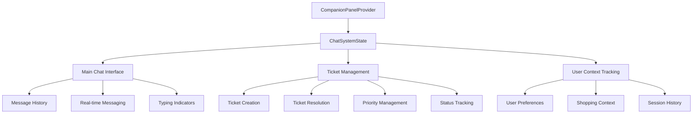

# 💬 Chat System Architecture

## Overview

The Companion Panel System includes a sophisticated chat and ticket management system that provides AI-powered customer support and shopping assistance. This system is deeply integrated with the panel context and provides both real-time chat capabilities and structured ticket management.

## 🏗️ System Architecture



## 📊 State Management

### Core State Structure

```typescript
interface ChatSystemState {
  // Main chat interface
  mainChat: {
    messages: ChatMessage[]
    isTyping: boolean
    lastActivity: number
  }
  
  // Ticket system
  tickets: ChatTicket[]
  activeTicketId: string | null
  ticketView: 'chat' | 'tickets'
  
  // User context
  userContext: UserChatContext
  
  // Analytics
  analytics: ChatAnalytics
}
```

### Message Structure

```typescript
interface ChatMessage {
  id: string
  content: string
  sender: 'user' | 'assistant' | 'system'
  timestamp: number
  type: 'text' | 'action' | 'suggestion' | 'error'
  metadata?: {
    ticketId?: string
    context?: any
    actions?: MessageAction[]
  }
}
```

### Ticket System

```typescript
interface ChatTicket {
  id: string
  type: 'support' | 'product-inquiry' | 'order-help' | 'technical'
  title: string
  status: 'open' | 'in-progress' | 'resolved' | 'closed'
  priority: 'low' | 'medium' | 'high' | 'urgent'
  messages: ChatMessage[]
  context: any
  createdAt: number
  updatedAt: number
  resolvedAt?: number
  summary?: string
}
```

## 🔧 API Reference

### Main Chat Functions

#### `sendMainChatMessage(content: string): Promise<void>`
Sends a message to the main chat interface.

```typescript
const { sendMainChatMessage } = useCompanionPanel()

await sendMainChatMessage("I'm looking for gaming laptops under $1500")
```

#### `setMainChatTyping(isTyping: boolean): void`
Updates the typing indicator state.

```typescript
const { setMainChatTyping } = useCompanionPanel()

setMainChatTyping(true)
// Simulate processing...
setTimeout(() => setMainChatTyping(false), 2000)
```

#### `updateUserContext(context: Partial<UserChatContext>): void`
Updates the user context for better AI assistance.

```typescript
const { updateUserContext } = useCompanionPanel()

updateUserContext({
  preferences: {
    budget: { min: 800, max: 1500 },
    categories: ['electronics', 'gaming']
  },
  currentPage: '/products/laptops',
  shoppingIntent: 'comparison'
})
```

### Ticket Management Functions

#### `createTicket(type, title, initialMessage?, context?): string`
Creates a new support ticket.

```typescript
const { createTicket } = useCompanionPanel()

const ticketId = createTicket(
  'product-inquiry',
  'Question about laptop specifications',
  'What are the differences between these models?',
  { productIds: ['laptop1', 'laptop2'] }
)
```

#### `sendTicketMessage(ticketId: string, content: string): Promise<void>`
Sends a message to a specific ticket.

```typescript
const { sendTicketMessage } = useCompanionPanel()

await sendTicketMessage(ticketId, "Thanks for the clarification!")
```

#### `resolveTicket(ticketId: string, summary?: string): void`
Marks a ticket as resolved.

```typescript
const { resolveTicket } = useCompanionPanel()

resolveTicket(ticketId, "Issue resolved: Customer found suitable laptop")
```

#### `updateTicketStatus(ticketId: string, status: ChatTicket['status']): void`
Updates ticket status.

```typescript
const { updateTicketStatus } = useCompanionPanel()

updateTicketStatus(ticketId, 'in-progress')
```

#### `updateTicketPriority(ticketId: string, priority: ChatTicket['priority']): void`
Updates ticket priority.

```typescript
const { updateTicketPriority } = useCompanionPanel()

updateTicketPriority(ticketId, 'high')
```

### Navigation Functions

#### `switchChatView(view: 'chat' | 'tickets'): void`
Switches between chat and ticket views.

```typescript
const { switchChatView } = useCompanionPanel()

switchChatView('tickets') // Show ticket list
switchChatView('chat')    // Show main chat
```

#### `selectTicket(ticketId: string | null): void`
Selects a specific ticket for viewing/editing.

```typescript
const { selectTicket } = useCompanionPanel()

selectTicket(ticketId) // View specific ticket
selectTicket(null)     // Deselect ticket
```

### Advanced Functions

#### `createTicketFromChatMessage(messageId: string, ticketType: ChatTicket['type'], title: string): string`
Converts a chat message into a structured ticket.

```typescript
const { createTicketFromChatMessage } = useCompanionPanel()

const ticketId = createTicketFromChatMessage(
  messageId,
  'technical',
  'Payment processing issue'
)
```

#### `inheritContextToTicket(ticketId: string, contextKeys: string[]): void`
Inherits context from main chat to a ticket.

```typescript
const { inheritContextToTicket } = useCompanionPanel()

inheritContextToTicket(ticketId, ['userPreferences', 'currentProducts'])
```

## 📈 Analytics

### `getChatAnalytics(): ChatAnalytics`
Returns comprehensive chat system analytics.

```typescript
const { getChatAnalytics } = useCompanionPanel()

const analytics = getChatAnalytics()
// Returns:
// {
//   totalMessages: number
//   activeTickets: number
//   resolvedTickets: number
//   averageResolutionTime: number
//   commonTopics: string[]
// }
```

## 🎯 Integration Patterns

### E-commerce Integration

```typescript
// Product inquiry workflow
const handleProductQuestion = async (productId: string, question: string) => {
  const { createTicket, updateUserContext } = useCompanionPanel()
  
  // Update context with product information
  updateUserContext({
    currentProducts: [productId],
    shoppingIntent: 'inquiry'
  })
  
  // Create ticket with product context
  const ticketId = createTicket(
    'product-inquiry',
    `Question about ${productId}`,
    question,
    { productId, source: 'product-page' }
  )
  
  return ticketId
}
```

### Shopping Assistant Workflow

```typescript
// AI shopping assistance
const startShoppingAssistance = async (intent: string) => {
  const { sendMainChatMessage, updateUserContext } = useCompanionPanel()
  
  // Set shopping context
  updateUserContext({
    shoppingIntent: intent,
    sessionStart: Date.now()
  })
  
  // Start conversation
  await sendMainChatMessage(`I'm looking for ${intent}`)
}
```

### Support Escalation

```typescript
// Escalate chat to human support
const escalateToSupport = (reason: string) => {
  const { createTicket, chatSystem } = useCompanionPanel()
  
  // Create high-priority support ticket
  const ticketId = createTicket(
    'support',
    'Escalated from chat',
    reason,
    { 
      chatHistory: chatSystem.mainChat.messages,
      escalationReason: reason,
      userContext: chatSystem.userContext
    }
  )
  
  updateTicketPriority(ticketId, 'high')
  return ticketId
}
```

## 🔒 Privacy & Security

### Data Handling
- All chat messages are stored locally in browser state
- No sensitive data is transmitted without user consent
- User context can be cleared at any time
- Ticket data includes only necessary context

### User Control
```typescript
// Clear user data
const clearChatData = () => {
  const { updateUserContext } = useCompanionPanel()
  
  updateUserContext({
    preferences: {},
    history: [],
    personalInfo: {}
  })
}
```

## ⚡ Performance Considerations

### Message Limits
- Main chat: Limited to 100 recent messages
- Tickets: No message limit per ticket
- Auto-cleanup of old resolved tickets

### Memory Management
```typescript
// Automatic cleanup configuration
const CHAT_CONFIG = {
  maxMainChatMessages: 100,
  maxResolvedTicketAge: 7 * 24 * 60 * 60 * 1000, // 7 days
  autoCleanupInterval: 60 * 60 * 1000 // 1 hour
}
```

### Optimization Tips
1. Use ticket system for long conversations
2. Clear resolved tickets regularly
3. Limit context data size
4. Use message batching for multiple sends

## 🧪 Testing

### Unit Testing
```typescript
// Test chat message sending
test('should send chat message successfully', async () => {
  const { result } = renderHook(() => useCompanionPanel())
  
  await act(async () => {
    await result.current.sendMainChatMessage('Test message')
  })
  
  expect(result.current.chatSystem.mainChat.messages).toHaveLength(1)
  expect(result.current.chatSystem.mainChat.messages[0].content).toBe('Test message')
})
```

### Integration Testing
```typescript
// Test ticket creation workflow
test('should create and manage ticket lifecycle', async () => {
  const { result } = renderHook(() => useCompanionPanel())
  
  // Create ticket
  let ticketId
  act(() => {
    ticketId = result.current.createTicket('support', 'Test Issue', 'Initial message')
  })
  
  // Send message to ticket
  await act(async () => {
    await result.current.sendTicketMessage(ticketId, 'Follow-up message')
  })
  
  // Resolve ticket
  act(() => {
    result.current.resolveTicket(ticketId, 'Resolved successfully')
  })
  
  const ticket = result.current.chatSystem.tickets.find(t => t.id === ticketId)
  expect(ticket.status).toBe('resolved')
  expect(ticket.messages).toHaveLength(2)
})
```

## 🚀 Future Enhancements

### Planned Features
- Real-time synchronization with backend
- Voice message support
- File attachment handling
- Multi-language support
- Advanced AI context understanding

### Integration Roadmap
- CRM system integration
- Analytics dashboard
- Performance monitoring
- A/B testing framework

## 📝 Best Practices

### Message Handling
1. Always validate message content before sending
2. Use appropriate message types for different contexts
3. Include relevant metadata for better AI responses
4. Handle async operations with proper error handling

### Ticket Management
1. Use descriptive ticket titles
2. Include relevant context when creating tickets
3. Update ticket status appropriately
4. Resolve tickets with meaningful summaries

### User Experience
1. Show typing indicators during processing
2. Provide clear feedback for user actions
3. Allow easy navigation between chat and tickets
4. Maintain conversation context across sessions