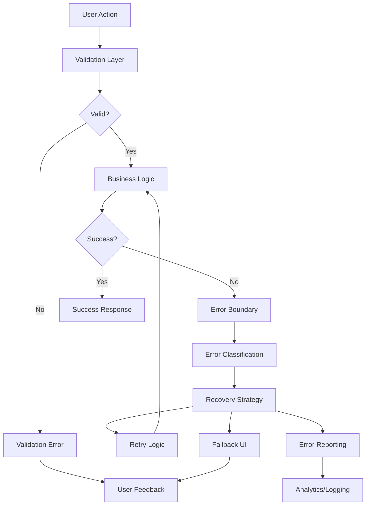

# 🛡️ Error Handling & Recovery

## Overview

The Companion Panel System implements comprehensive error handling and recovery mechanisms to ensure a robust user experience. This document covers error patterns, recovery strategies, and best practices for handling failures gracefully.

## 🏗️ Error Handling Architecture



## 🎯 Error Categories

### 1. Validation Errors
Client-side validation failures before API calls.

```typescript
interface ValidationError {
  type: 'validation'
  field: string
  message: string
  code: string
}

// Example: Cart validation
const validateCartItem = (item: CartItem): ValidationError[] => {
  const errors: ValidationError[] = []
  
  if (!item.variantId) {
    errors.push({
      type: 'validation',
      field: 'variantId',
      message: 'Product variant is required',
      code: 'VARIANT_REQUIRED'
    })
  }
  
  if (item.quantity <= 0) {
    errors.push({
      type: 'validation',
      field: 'quantity',
      message: 'Quantity must be greater than 0',
      code: 'INVALID_QUANTITY'
    })
  }
  
  return errors
}
```

### 2. Network Errors
API communication failures and connectivity issues.

```typescript
interface NetworkError {
  type: 'network'
  status?: number
  message: string
  code: string
  retryable: boolean
}

// Example: API error handling
const handleApiError = (error: any): NetworkError => {
  if (error.response) {
    // Server responded with error status
    return {
      type: 'network',
      status: error.response.status,
      message: error.response.data.message || 'Server error',
      code: `HTTP_${error.response.status}`,
      retryable: error.response.status >= 500
    }
  } else if (error.request) {
    // Network connectivity issue
    return {
      type: 'network',
      message: 'Network connection failed',
      code: 'NETWORK_ERROR',
      retryable: true
    }
  } else {
    // Request setup error
    return {
      type: 'network',
      message: error.message,
      code: 'REQUEST_ERROR',
      retryable: false
    }
  }
}
```

### 3. Business Logic Errors
Domain-specific errors from business operations.

```typescript
interface BusinessError {
  type: 'business'
  operation: string
  message: string
  code: string
  context?: any
}

// Example: Inventory error
const handleInventoryError = (productId: string): BusinessError => ({
  type: 'business',
  operation: 'add_to_cart',
  message: 'Product is out of stock',
  code: 'OUT_OF_STOCK',
  context: { productId }
})
```

### 4. System Errors
Unexpected application errors and exceptions.

```typescript
interface SystemError {
  type: 'system'
  message: string
  code: string
  stack?: string
  context?: any
}

// Example: Component error boundary
const handleComponentError = (error: Error, errorInfo: any): SystemError => ({
  type: 'system',
  message: error.message,
  code: 'COMPONENT_ERROR',
  stack: error.stack,
  context: errorInfo
})
```

## 🔄 Recovery Strategies

### 1. Retry Logic with Exponential Backoff

```typescript
interface RetryConfig {
  maxRetries: number
  initialDelay: number
  maxDelay: number
  backoffMultiplier: number
}

class RetryHandler {
  private config: RetryConfig = {
    maxRetries: 3,
    initialDelay: 1000,
    maxDelay: 10000,
    backoffMultiplier: 2
  }

  async executeWithRetry<T>(
    operation: () => Promise<T>,
    isRetryable: (error: any) => boolean = () => true
  ): Promise<T> {
    let lastError: any
    
    for (let attempt = 0; attempt <= this.config.maxRetries; attempt++) {
      try {
        return await operation()
      } catch (error) {
        lastError = error
        
        if (attempt === this.config.maxRetries || !isRetryable(error)) {
          throw error
        }
        
        const delay = Math.min(
          this.config.initialDelay * Math.pow(this.config.backoffMultiplier, attempt),
          this.config.maxDelay
        )
        
        await this.sleep(delay)
      }
    }
    
    throw lastError
  }

  private sleep(ms: number): Promise<void> {
    return new Promise(resolve => setTimeout(resolve, ms))
  }
}

// Usage example
const retryHandler = new RetryHandler()

const addToCartWithRetry = async (variantId: string, quantity: number) => {
  return retryHandler.executeWithRetry(
    () => addToCart({ variantId, quantity, countryCode: 'us' }),
    (error) => error.response?.status >= 500 // Only retry server errors
  )
}
```

### 2. Circuit Breaker Pattern

```typescript
enum CircuitState {
  CLOSED = 'closed',
  OPEN = 'open',
  HALF_OPEN = 'half-open'
}

interface CircuitBreakerConfig {
  failureThreshold: number
  timeoutDuration: number
  monitoringPeriod: number
}

class CircuitBreaker {
  private state = CircuitState.CLOSED
  private failureCount = 0
  private lastFailureTime = 0
  private config: CircuitBreakerConfig

  constructor(config: CircuitBreakerConfig) {
    this.config = config
  }

  async execute<T>(operation: () => Promise<T>): Promise<T> {
    if (this.state === CircuitState.OPEN) {
      if (Date.now() - this.lastFailureTime > this.config.timeoutDuration) {
        this.state = CircuitState.HALF_OPEN
      } else {
        throw new Error('Circuit breaker is open')
      }
    }

    try {
      const result = await operation()
      this.onSuccess()
      return result
    } catch (error) {
      this.onFailure()
      throw error
    }
  }

  private onSuccess(): void {
    this.failureCount = 0
    this.state = CircuitState.CLOSED
  }

  private onFailure(): void {
    this.failureCount++
    this.lastFailureTime = Date.now()
    
    if (this.failureCount >= this.config.failureThreshold) {
      this.state = CircuitState.OPEN
    }
  }
}
```

### 3. Graceful Degradation

```typescript
// Feature degradation based on error conditions
const useFeatureWithFallback = (featureKey: string, fallbackValue: any) => {
  const [value, setValue] = useState(fallbackValue)
  const [error, setError] = useState<Error | null>(null)

  useEffect(() => {
    const loadFeature = async () => {
      try {
        if (isFeatureEnabled(featureKey)) {
          const featureValue = await loadFeatureData(featureKey)
          setValue(featureValue)
        }
      } catch (err) {
        console.warn(`Feature ${featureKey} failed to load, using fallback:`, err)
        setError(err as Error)
        setValue(fallbackValue)
      }
    }

    loadFeature()
  }, [featureKey, fallbackValue])

  return { value, error, isUsingFallback: error !== null }
}

// Usage in components
const ProductRecommendations = () => {
  const { value: recommendations, isUsingFallback } = useFeatureWithFallback(
    'ai-recommendations',
    [] // Fallback to empty array
  )

  return (
    <div>
      {isUsingFallback && (
        <div className="bg-yellow-50 p-2 text-sm text-yellow-800">
          Recommendations temporarily unavailable
        </div>
      )}
      {recommendations.map(product => (
        <ProductCard key={product.id} product={product} />
      ))}
    </div>
  )
}
```

## 🎨 Error UI Components

### 1. Error Boundary Component

```typescript
interface ErrorBoundaryState {
  hasError: boolean
  error?: Error
  errorInfo?: any
}

class ErrorBoundary extends React.Component<
  { children: React.ReactNode; fallback?: React.ComponentType<any> },
  ErrorBoundaryState
> {
  constructor(props: any) {
    super(props)
    this.state = { hasError: false }
  }

  static getDerivedStateFromError(error: Error): ErrorBoundaryState {
    return { hasError: true, error }
  }

  componentDidCatch(error: Error, errorInfo: any) {
    this.setState({ errorInfo })
    
    // Log error to monitoring service
    logError({
      type: 'system',
      message: error.message,
      stack: error.stack,
      context: errorInfo
    })
  }

  render() {
    if (this.state.hasError) {
      const { fallback: Fallback } = this.props
      
      if (Fallback) {
        return <Fallback error={this.state.error} />
      }

      return (
        <div className="error-boundary">
          <h2>Something went wrong</h2>
          <p>We're sorry for the inconvenience. Please try refreshing the page.</p>
          <button onClick={() => window.location.reload()}>
            Refresh Page
          </button>
        </div>
      )
    }

    return this.props.children
  }
}
```

### 2. Error Message Component

```typescript
interface ErrorMessageProps {
  error: Error | string
  type?: 'error' | 'warning' | 'info'
  dismissible?: boolean
  onDismiss?: () => void
  actions?: Array<{
    label: string
    action: () => void
    variant?: 'primary' | 'secondary'
  }>
}

const ErrorMessage: React.FC<ErrorMessageProps> = ({
  error,
  type = 'error',
  dismissible = false,
  onDismiss,
  actions = []
}) => {
  const message = typeof error === 'string' ? error : error.message

  const getIcon = () => {
    switch (type) {
      case 'error': return '❌'
      case 'warning': return '⚠️'
      case 'info': return 'ℹ️'
      default: return '❌'
    }
  }

  const getStyles = () => {
    switch (type) {
      case 'error': return 'bg-red-50 text-red-800 border-red-200'
      case 'warning': return 'bg-yellow-50 text-yellow-800 border-yellow-200'
      case 'info': return 'bg-blue-50 text-blue-800 border-blue-200'
      default: return 'bg-red-50 text-red-800 border-red-200'
    }
  }

  return (
    <div className={`border rounded-lg p-4 ${getStyles()}`}>
      <div className="flex items-start">
        <span className="mr-2">{getIcon()}</span>
        <div className="flex-1">
          <p className="font-medium">{message}</p>
          {actions.length > 0 && (
            <div className="mt-3 space-x-2">
              {actions.map((action, index) => (
                <button
                  key={index}
                  onClick={action.action}
                  className={`px-3 py-1 text-sm rounded ${
                    action.variant === 'primary'
                      ? 'bg-red-600 text-white'
                      : 'bg-red-100 text-red-800'
                  }`}
                >
                  {action.label}
                </button>
              ))}
            </div>
          )}
        </div>
        {dismissible && (
          <button
            onClick={onDismiss}
            className="ml-2 text-gray-400 hover:text-gray-600"
          >
            ×
          </button>
        )}
      </div>
    </div>
  )
}
```

### 3. Loading States with Error Handling

```typescript
interface AsyncState<T> {
  data: T | null
  loading: boolean
  error: Error | null
}

const useAsyncData = <T>(
  asyncFunction: () => Promise<T>,
  dependencies: any[] = []
): AsyncState<T> => {
  const [state, setState] = useState<AsyncState<T>>({
    data: null,
    loading: true,
    error: null
  })

  useEffect(() => {
    let cancelled = false

    const loadData = async () => {
      setState(prev => ({ ...prev, loading: true, error: null }))

      try {
        const data = await asyncFunction()
        if (!cancelled) {
          setState({ data, loading: false, error: null })
        }
      } catch (error) {
        if (!cancelled) {
          setState({
            data: null,
            loading: false,
            error: error as Error
          })
        }
      }
    }

    loadData()

    return () => {
      cancelled = true
    }
  }, dependencies)

  return state
}

// Usage example
const ProductDetails = ({ productId }: { productId: string }) => {
  const { data: product, loading, error } = useAsyncData(
    () => fetchProduct(productId),
    [productId]
  )

  if (loading) return <ProductSkeleton />
  
  if (error) {
    return (
      <ErrorMessage
        error={error}
        actions={[
          {
            label: 'Retry',
            action: () => window.location.reload(),
            variant: 'primary'
          }
        ]}
      />
    )
  }

  return <ProductCard product={product} />
}
```

## 🔍 Error Monitoring & Logging

### 1. Error Tracking Service

```typescript
interface ErrorLog {
  id: string
  timestamp: number
  type: 'validation' | 'network' | 'business' | 'system'
  message: string
  code: string
  stack?: string
  context?: any
  userId?: string
  sessionId: string
  url: string
  userAgent: string
}

class ErrorTracker {
  private errors: ErrorLog[] = []
  private sessionId: string = this.generateSessionId()

  logError(error: Partial<ErrorLog>): void {
    const errorLog: ErrorLog = {
      id: this.generateId(),
      timestamp: Date.now(),
      sessionId: this.sessionId,
      url: window.location.href,
      userAgent: navigator.userAgent,
      ...error
    } as ErrorLog

    this.errors.push(errorLog)
    
    // Send to monitoring service (implement based on your service)
    this.sendToMonitoring(errorLog)
    
    // Log to console in development
    if (process.env.NODE_ENV === 'development') {
      console.error('Error logged:', errorLog)
    }
  }

  private async sendToMonitoring(error: ErrorLog): Promise<void> {
    try {
      // Replace with your monitoring service endpoint
      await fetch('/api/errors', {
        method: 'POST',
        headers: { 'Content-Type': 'application/json' },
        body: JSON.stringify(error)
      })
    } catch (err) {
      console.warn('Failed to send error to monitoring service:', err)
    }
  }

  getErrors(): ErrorLog[] {
    return [...this.errors]
  }

  clearErrors(): void {
    this.errors = []
  }

  private generateId(): string {
    return Math.random().toString(36).substr(2, 9)
  }

  private generateSessionId(): string {
    return Math.random().toString(36).substr(2, 16)
  }
}

export const errorTracker = new ErrorTracker()
```

### 2. Integration with Companion Panel Context

```typescript
// Enhanced error handling in companion panel context
const handlePanelError = (error: any, context: string) => {
  const errorInfo = {
    type: 'system' as const,
    message: error.message,
    code: 'PANEL_ERROR',
    context: {
      operation: context,
      panelState: {
        isOpen,
        currentPanel: currentPanel?.type,
        historyCount: panelHistory.length
      }
    }
  }

  errorTracker.logError(errorInfo)
  
  // Show user-friendly error
  setError({
    message: 'Something went wrong with the panel. Please try again.',
    type: 'error',
    dismissible: true
  })
}

// Usage in panel operations
const openPanel = useCallback((type: PanelType, data?: any, title?: string) => {
  try {
    // ... panel opening logic
  } catch (error) {
    handlePanelError(error, 'openPanel')
  }
}, [])
```

## 📊 Error Analytics

### 1. Error Rate Monitoring

```typescript
class ErrorAnalytics {
  private errorCounts = new Map<string, number>()
  private timeWindows = new Map<string, number[]>()

  recordError(code: string): void {
    // Increment error count
    this.errorCounts.set(code, (this.errorCounts.get(code) || 0) + 1)
    
    // Add to time window (last hour)
    const now = Date.now()
    const hourKey = Math.floor(now / (60 * 60 * 1000)).toString()
    const timeWindow = this.timeWindows.get(hourKey) || []
    timeWindow.push(now)
    this.timeWindows.set(hourKey, timeWindow)
  }

  getErrorRate(timeWindowMs: number = 60 * 60 * 1000): number {
    const now = Date.now()
    const cutoff = now - timeWindowMs
    let totalErrors = 0

    for (const [, timestamps] of this.timeWindows) {
      totalErrors += timestamps.filter(ts => ts > cutoff).length
    }

    return totalErrors / (timeWindowMs / 1000) // errors per second
  }

  getTopErrors(limit: number = 10): Array<{ code: string; count: number }> {
    return Array.from(this.errorCounts.entries())
      .map(([code, count]) => ({ code, count }))
      .sort((a, b) => b.count - a.count)
      .slice(0, limit)
  }
}

export const errorAnalytics = new ErrorAnalytics()
```

## 🧪 Testing Error Scenarios

### 1. Error Simulation

```typescript
// Test utilities for error scenarios
export const errorTestUtils = {
  simulateNetworkError: () => {
    throw new Error('Network connection failed')
  },

  simulateValidationError: (field: string) => {
    throw new ValidationError(`Invalid ${field}`)
  },

  simulateBusinessError: (code: string, message: string) => {
    const error = new Error(message)
    error.code = code
    throw error
  },

  mockApiError: (status: number, message: string) => {
    const error = new Error(message)
    error.response = { status, data: { message } }
    throw error
  }
}

// Test example
test('should handle cart addition error gracefully', async () => {
  const { result } = renderHook(() => useCompanionPanel())
  
  // Mock API to throw error
  jest.spyOn(api, 'addToCart').mockRejectedValue(
    errorTestUtils.mockApiError(500, 'Server error')
  )

  await act(async () => {
    try {
      await result.current.addToCart('variant_123', 1)
    } catch (error) {
      // Error should be handled gracefully
    }
  })

  // Verify error was logged
  expect(errorTracker.getErrors()).toHaveLength(1)
})
```

## 📋 Best Practices

### 1. Error Handling Guidelines
- Always provide meaningful error messages to users
- Log technical details for debugging but show user-friendly messages
- Implement proper fallbacks for non-critical features
- Use appropriate retry strategies for transient errors
- Monitor error rates and patterns

### 2. User Experience
- Show loading states during error recovery
- Provide clear actions users can take
- Avoid cascading error messages
- Preserve user data when possible during errors
- Test error scenarios thoroughly

### 3. Development Practices
- Use TypeScript for better error type safety
- Implement comprehensive error boundaries
- Test error scenarios in addition to happy paths
- Document error codes and their meanings
- Regularly review error logs and patterns

## 🚀 Future Enhancements

### Planned Improvements
- Automatic error recovery for common scenarios
- Machine learning-based error prediction
- Enhanced error categorization and routing
- Integration with customer support systems
- Real-time error monitoring dashboard